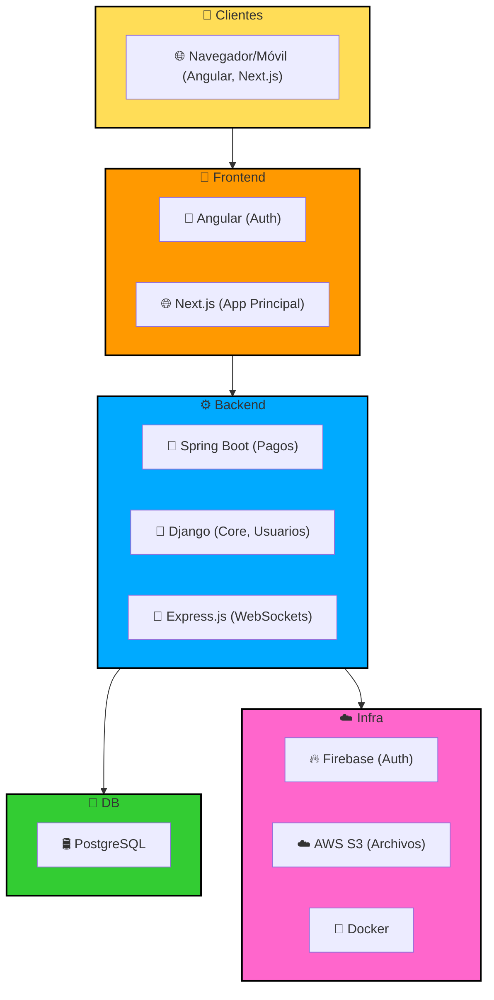

# 🏥 CareLink Nexora ✨

### Tu conexión digital para el cuidado integral - Innovación con calidez humana


[]()
[]()
[]()
[]()
[]()
[]()
[]()

---

[Características](#-características) •
[Instalación](#-instalación) •
[Arquitectura](#-arquitectura) •
[Vistas](#-vistas) •
[Equipo](#-equipo)

## 🌟 Bienvenidos a CareLink Nexora

> *"Conectando el cuidado humano con la innovación tecnológica"*

CareLink Nexora representa la perfecta fusión entre la calidez del cuidado personal y la innovación tecnológica. Nuestra plataforma combina lo mejor de ambos mundos: la confiabilidad y cercanía de CareLink con la sofisticación y modernidad de Nexora, creando un ecosistema digital que prioriza tanto la eficiencia como el bienestar humano. 🎯

## ✨ Características Principales

| **🤝 Conexión Humana**                              | **🔬 Innovación Nexora**                          |
|---------------------------------------------------|--------------------------------------------------|
| 📅 Gestión personalizada de cuidados               | 🤖 IA para optimización de cuidados              |
| 🎯 Sistema de seguimiento integral                | 📈 Analítica predictiva                          |
| ⏰ Atención continua y proactiva                   | ⚡ Respuesta en tiempo real                       |
| 🌟 Experiencias personalizadas                     | 🎯 Personalización inteligente                   |
| 📊 Análisis de bienestar                          | 📱 Tecnología adaptativa                         |

| **💊 Control Médico Inteligente**                   | **📱 Comunicación Unificada**                    |
|---------------------------------------------------|--------------------------------------------------|
| ⏰ Gestión avanzada de medicación                  | 📲 Plataforma multicanal                         |
| 📋 Historia clínica digital                        | 📱 Integración con WhatsApp                      |
| 🔔 Sistema de alertas inteligentes                 | 📧 Sistema de notificaciones                     |
| 💉 Gestión de inventario médico                    | 🤖 Asistente virtual                             |
| 👩‍⚕️ Teleconsulta integrada                       | 🔄 Comunicación en tiempo real                   |


## 🚀 Arquitectura Tecnológica



## 💻 Stack Tecnológico

### Frontend Powerhouse
- **🔐 Auth Service**: Angular 18
```typescript
const security = "máxima prioridad"
```

### 🌐 Main Application: Next.js 15
```typescript
const performance = "optimizada"
```
### Backend Robusto
- **🍃 Spring Boot**: Gestión de pagos y reservas
- **🐍 Django**: Core del sistema y usuarios
- **🚂 Express**: Sistema de notificaciones


## 🛠️ Instalación y Configuración

### Requisitos del Sistema

#### Lenguajes y Runtimes

| Componente  | Versión | Descripción                                      |
|-------------|---------|--------------------------------------------------|
| Node.js     | ≥16.x   | Runtime para aplicaciones JavaScript             |
| Python      | ≥3.9    | Backend Django REST Framework                    |
| Java        | ≥17     | Backend Spring Boot                              |
| TypeScript  | ≥4.x    | Tipado estático para JavaScript                  |

#### Frameworks y Librerías

| Componente  | Versión | Descripción                                      |
|-------------|---------|--------------------------------------------------|
| Angular     | ≥19.x   | Framework frontend                               |
| Next.js     | ≥13.x   | Framework React SSR                              |
| Django      | ≥4.x    | Framework Python                                 |
| Spring Boot | ≥3.x    | Framework Java                                   |
| Express     | ≥4.x    | Framework Node.js                                |

#### Bases de Datos y Cache

| Componente  | Versión | Descripción                                      |
|-------------|---------|--------------------------------------------------|
| PostgreSQL  | ≥13     | Base de datos principal                          |
| Redux       | ≥7.x    | Sistema de store                                 |

#### Herramientas de Desarrollo

| Componente  | Versión | Descripción                                      |
|-------------|---------|--------------------------------------------------|
| Docker      | ≥20.x   | Contenedorización                                |
| Git         | ≥2.x    | Control de versiones                             |
| npm/yarn    | ≥8.x    | Gestores de paquetes JS                          |
| pip         | ≥22.x   | Gestor de paquetes Python                        |
| Gradle      | ≥3.x    | Gestor de dependencias Java                      |

#### Seguridad y Autenticación

| Componente  | Versión | Descripción                                      |
|-------------|---------|--------------------------------------------------|
| JWT         | ≥9.x    | Tokens de autenticación                          |
| Argon2      | ≥21.x   | Hashing de contraseñas                           |


### 🚀 Inicio Rápido con Docker

```bash
# Clonar el repositorio
git clone https://github.com/yourusername/carelink-nexora.git

# Iniciar con Docker Compose
docker-compose up -d
```

## 📸 Vistas del Sistema

|  |  |
|:---:|:---:|
| *Panel de Control Nexora 🎮* | *Gestión de Cuidados 🤝* |
|  |  |
| *Sistema de Monitoreo 📊* | *Centro de Comunicación 💬* |

## 👥 Nuestro Increíble Equipo

| .png) |
|:---:|
| **Javier Tomás Tormo** |
| ⚙️ Full Stack |
| [](https://github.com/JavierTomasTormo) |

## 🤝 ¿Quieres Contribuir?

¡Tu ayuda es bienvenida! Sigue estos pasos:

1. 🍴 Fork el proyecto
2. 🔧 Crea tu Feature Branch
```bash
git checkout -b feature/CaracteristicaIncreible
```

3. 💫 Commit tus cambios
```bash
git commit -m '✨ Add: Característica Increíble'
```

📤 **Push a la Branch**  
🎉 **Abre un Pull Request**  

📝 **Licencia**  
Este proyecto está bajo la Licencia MIT - mira el archivo LICENSE.md para detalles.

🌟 **¿Necesitas Ayuda?**  

| Imagen                                                      | Enlace                                                                 |
|-------------------------------------------------------------|------------------------------------------------------------------------|
|  | [LinkedIn](https://www.linkedin.com/in/javier-tomás-tormo-81452132a/) |
|   | [GitHub](https://github.com/JavierTomasTormo)                         |
|           | [Gmail](mailto:javiertomastormo@gmail.com)                             |

Made with 💖 & ☕ by CareLink Nexora Team


