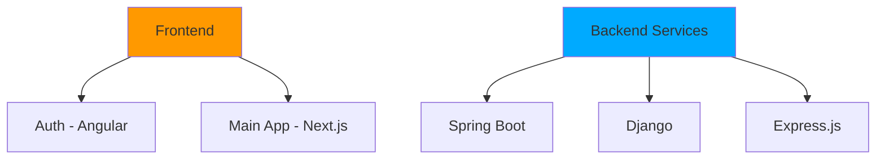

# VitalNest 🏡✨


¡Bienvenidos a **VitalNest**! Donde la gestión de residencias se transforma en una experiencia extraordinaria. Nuestra plataforma integral combina tecnología de vanguardia con un enfoque humano para crear un ambiente acogedor y eficiente. 🌟

[](https://github.com/yourusername/vitalnest)
[](https://github.com/yourusername/vitalnest/LICENSE)

---

## 🌈 ¿Qué es VitalNest?

VitalNest es tu compañero digital para la gestión integral de residencias, diseñado para hacer la vida más fácil, organizada y feliz para residentes y administradores por igual. Imagina un lugar donde cada aspecto de la vida en residencia está perfectamente organizado y al alcance de tus dedos. 🎯

### ✨ Características Principales

- 🎨 **Gestión de Actividades**
  - Calendario interactivo de eventos
  - Sistema de inscripción inteligente
  - Recordatorios automáticos
  
- 🍏 **Control de Dietas**
  - Planificación personalizada
  - Seguimiento nutricional
  - Alertas de alergias
  
- 💊 **Gestión de Medicamentos**
  - Programación de dosis
  - Historial médico
  - Notificaciones inteligentes
  
- 📱 **Sistema de Notificaciones Multicanal**
  - Notificaciones en app
  - Integración con WhatsApp
  - Alertas por email
  - Bot de Telegram
  - Generación de QR y PDF

## 🚀 Arquitectura Tecnológica

Nuestra arquitectura está diseñada para ofrecer máximo rendimiento y escalabilidad:



### 🎨 Frontend
- **Auth Service** (Angular)
  - Sistema de autenticación robusto
  - Gestión de sesiones
  - Control de acceso

- **Main Application** (Next.js)
  - Home & Dashboard
  - Gestión de Actividades
  - Control de Medicamentos
  - Sistema de Dietas
  - Perfiles de Usuario

### ⚙️ Backend
- **Spring Boot Service**
  - Gestión de inscripciones
  - Sistema de pagos
  - Procesamiento de cancelaciones

- **Django Service**
  - Gestión de usuarios
  - Base de datos principal
  - Lógica de negocio core

- **Express Service**
  - Sistema de notificaciones
  - Generación de QR
  - Creación de PDF
  - Integración con mensajería

## 🛠️ Instalación y Configuración

### Requisitos Previos
- Node.js >= 16.x
- Python >= 3.8
- Java >= 11
- PostgreSQL >= 13
- Redis

### Pasos de Instalación

1. **Clonar el Repositorio**
```bash
git clone https://github.com/yourusername/vitalnest.git
cd vitalnest
```

2. **Configurar Frontend**
```bash
# Auth Service (Angular)
cd auth-service
npm install
npm start

# Main App (Next.js)
cd ../main-app
npm install
npm run dev
```

3. **Configurar Backend**
```bash
# Spring Boot Service
cd ../spring-service
./mvnw spring-boot:run

# Django Service
cd ../django-service
python -m venv venv
source venv/bin/activate  # En Windows: venv\Scripts\activate
pip install -r requirements.txt
python manage.py migrate
python manage.py runserver

# Express Service
cd ../express-service
npm install
npm start
```

## 📸 Vistas del Sistema

| Home Dashboard | Gestión de Actividades |
|:---:|:---:|
|  |  |
| *Tu centro de control* 🎮 | *Diversión y bienestar* 🎨 |

| Sistema de Dietas | Gestión de Medicamentos |
|:---:|:---:|
|  |  |
| *Nutrición personalizada* 🥗 | *Salud y bienestar* 💊 |

## 🤝 Contribución

¡Nos encanta recibir ayuda! Si quieres contribuir:

1. 🍴 Haz un Fork del proyecto
2. 🔧 Crea tu Feature Branch (`git checkout -b feature/AmazingFeature`)
3. 💫 Commit tus cambios (`git commit -m 'Add: Amazing Feature'`)
4. 📤 Push a la Branch (`git push origin feature/AmazingFeature`)
5. 🎉 Abre un Pull Request

## 📝 Licencia

Este proyecto está bajo la Licencia MIT - mira el archivo [LICENSE.md](LICENSE.md) para detalles

## 👥 Equipo

Creado con 💖 por el equipo VitalNest

¿Preguntas? Contáctanos en support@vitalnest.com

---

> Made with 🧡 for a better life in residences
> - [Javier Tomás Tormo](https://github.com/JavierTomasTormo)  
> - [Llorenç Alfonso Sanchis](https://github.com/alfosan)  
